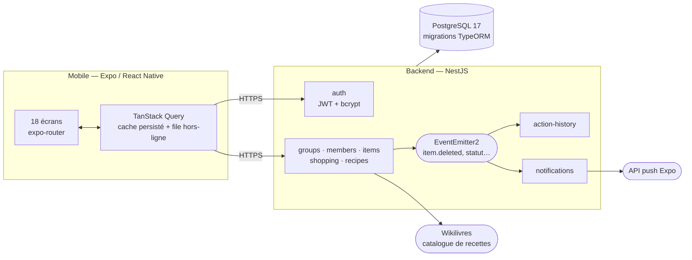

# Restock

Un inventaire partagé pour les colocations, les associations — et pour ceux qui
vivent seuls. Chaque chose que le foyer suit devient une étiquette qu'on tire
vers la gauche quand on en prend, vers la droite quand on en rachète. La liste
de courses se remplit toute seule à partir de ce qui manque.

L'app est en français, et le restera tant que l'internationalisation n'aura pas
été faite (voir [Ce qui manque](#ce-qui-manque)).

## Ce que ça fait

- **L'étagère** — des étiquettes, un geste de balayage, un stock qui descend.
  Deux façons de suivre : par seuil (« il y en a / il n'y en a plus ») ou par
  quantité, avec paquets et unités.
- **La liste de courses** — se remplit de ce que l'étagère réclame, se coche au
  magasin, et se reverse dans les stocks d'un seul geste en sortant.
- **Les recettes** — cherchées sur le web depuis l'app, gardées comme on garde
  une vidéo, et triées par **ce qui manque le moins** dans le placard.
- **Le journal** — le registre de qui a pris quoi et quand. Ouvert à tous les
  membres : un registre que seuls les responsables peuvent lire ne prouve rien
  à ceux qui devraient s'y fier.
- **Trois modes** — solo, colocation, association. Le solo retire ce qui n'a
  pas de sens à une seule personne : les auteurs, les invitations, la gestion
  des membres.

## L'architecture



Le cache du mobile est persisté sur disque, et les gestes faits hors réseau
sont rejoués au retour de la connexion. La faisabilité d'une recette se calcule
**côté client**, en croisant ses ingrédients avec l'étagère déjà en cache —
c'est ce qui la fait marcher sans réseau.

## Démarrer

Il faut Node 22, pnpm 11 et Docker.

### Le backend

```bash
cd backend
cp .env.example .env          # les valeurs par défaut suffisent en local
docker compose up -d          # PostgreSQL 17 sur le port 5434
pnpm install
pnpm migration:run
pnpm start:dev                # http://localhost:3000
```

### Le mobile

```bash
cd mobile
pnpm install
pnpm start                    # puis « a », « i », ou le QR code
```

Sur un appareil physique, l'adresse de l'API se déduit de celle de Metro : rien
à configurer tant que le téléphone et la machine sont sur le même réseau. Pour
viser un autre serveur, poser `EXPO_PUBLIC_API_URL`.

## Les tests

```bash
cd backend && pnpm test        # 221 unitaires
cd backend && pnpm test:e2e    # 228 e2e, contre un vrai PostgreSQL
cd mobile  && pnpm test        # 166
```

Les e2e parlent à une vraie base plutôt qu'à un double : ils vérifient des
contraintes d'unicité, des suppressions en cascade et des transactions, qu'un
faux ne reproduit pas.

La CI (`.github/workflows/ci.yml`) rejoue les trois suites plus le typage et le
lint, sur chaque PR et sur chaque poussée dans `main`.

## Déployer

### Le backend

[`render.yaml`](render.yaml) décrit le service et sa base. Sur Render :
_New → Blueprint_, pointer sur ce dépôt. Le `JWT_SECRET` est tiré au sort par
Render, les identifiants de la base sont injectés depuis la base déclarée, et
les migrations passent au démarrage — `migrationsRun` est vrai en production.

L'image se construit et se vérifie en local :

```bash
cd backend
docker build -t restock-backend .
docker run --rm -p 3000:3000 \
  -e DB_HOST=… -e DB_USER=… -e DB_PASSWORD=… -e DB_NAME=… \
  -e JWT_SECRET=$(openssl rand -hex 32) \
  restock-backend
curl localhost:3000/health     # {"status":"ok"}
```

`/health` interroge la base, pas seulement le processus : un serveur qui écoute
pendant que PostgreSQL est injoignable répond 500 à chaque requête utile.

> **Une base existante créée par `synchronize`** (avant que les migrations
> existent) refusera de démarrer — la première migration voudra recréer des
> types qui sont déjà là. Il faut la recréer, ou inscrire à la main les
> migrations déjà appliquées dans la table `migrations`.

### Le mobile

```bash
cd mobile
eas build --profile preview --platform android   # un APK à installer
eas build --profile production --platform all
```

Les profils `preview` et `production` pointent `EXPO_PUBLIC_API_URL` sur
`https://restock-api.onrender.com`, l'adresse que Render donne au service nommé
`restock-api` dans le blueprint. **Changer l'un, c'est changer l'autre.**

## L'organisation du dépôt

```
backend/          NestJS — un module par domaine
  src/auth        inscription, connexion, JWT
  src/groups      groupes, invitations, types
  src/members     membres, rôles, jetons push
  src/items       l'étagère et sa machine à états
  src/shopping    la liste de courses
  src/recipes     recettes et catalogue Wikilivres
  src/action-history  le journal
  src/health      la sonde de l'hébergeur
  src/migrations  le schéma, versionné
  test/           les e2e, contre un vrai PostgreSQL

mobile/           Expo — expo-router, un fichier par écran
  app/            les écrans et la navigation
  src/api         requêtes, cache, file hors-ligne
  src/components  les formes du système de design
  src/lib         la logique métier testable, hors composants
  src/theme       couleurs, typographie, contrastes mesurés

restock-technical-spec.md   la spécification d'origine
render.yaml                 le déploiement du backend
```

## Ce qui manque

- **Le journal n'a pas d'écran.** `GET /history` est servi et personne ne
  l'appelle.
- **Le mode association ne fait rien.** Écran pour écran, il est identique à la
  colocation ; le type n'est comparé nulle part.
- **Aucune internationalisation.** Le français est en dur, et jusque dans la
  logique — `localeCompare(…, 'fr')`, les règles de pluriel de `units.ts`.
- **Un seul tutoriel**, sur le balayage.
- **Les notifications push n'ont jamais été vérifiées de bout en bout.** Le
  circuit est complet des deux côtés, mais l'essayer exige un build EAS : Expo
  Go ne reçoit pas de notifications.
